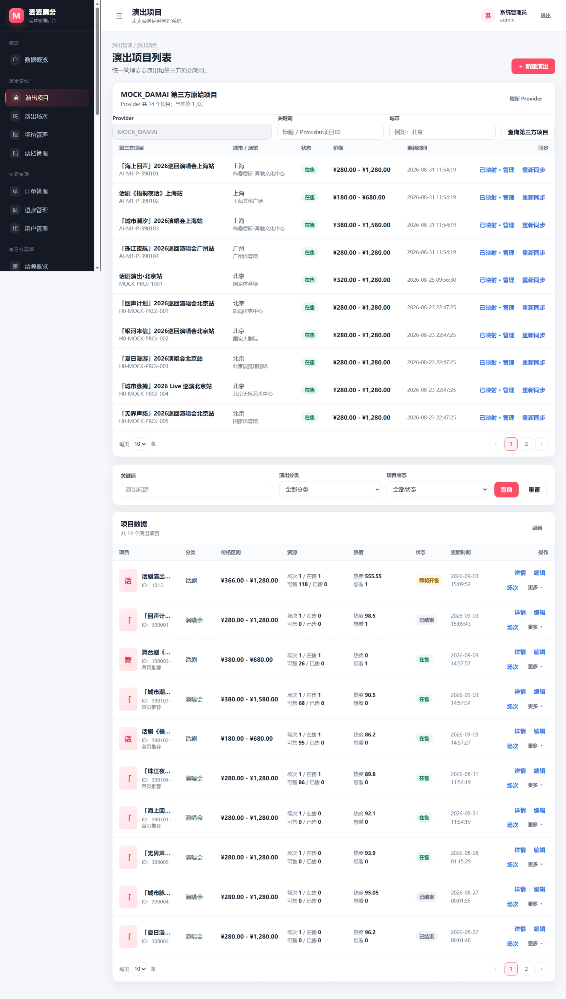
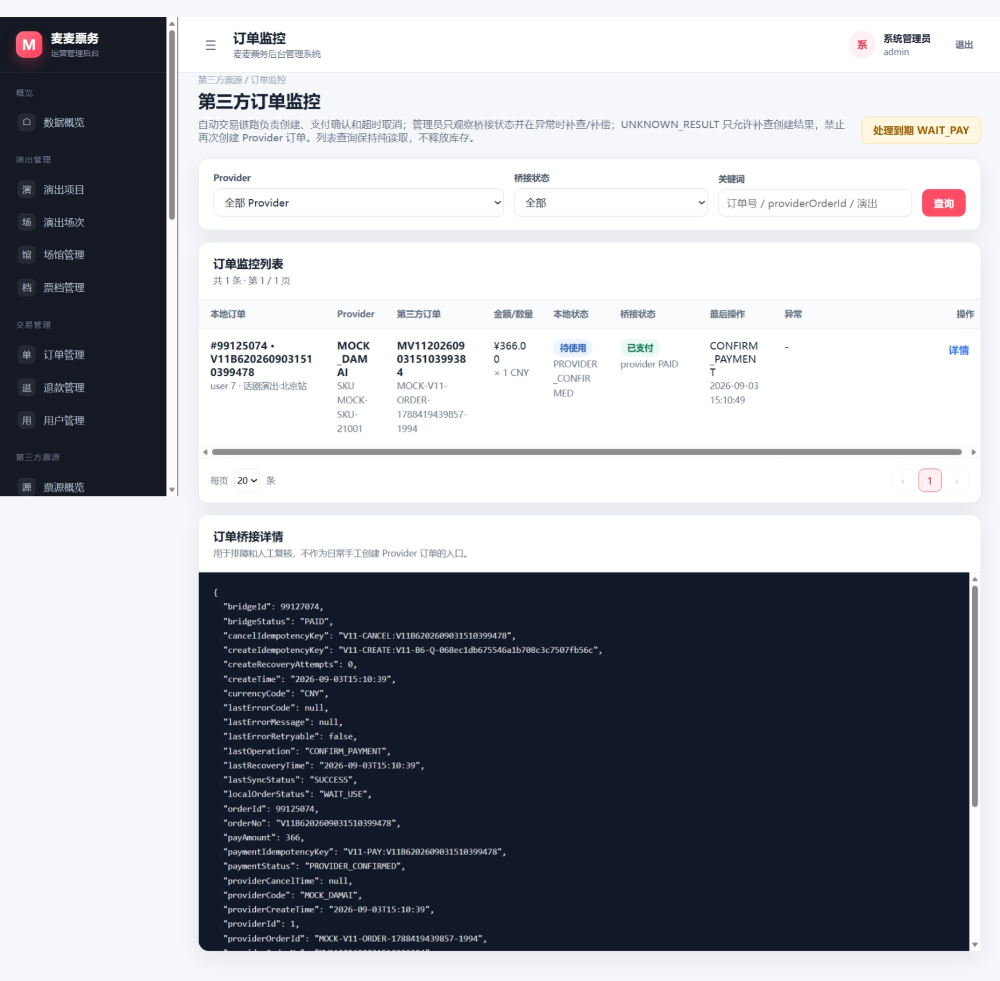
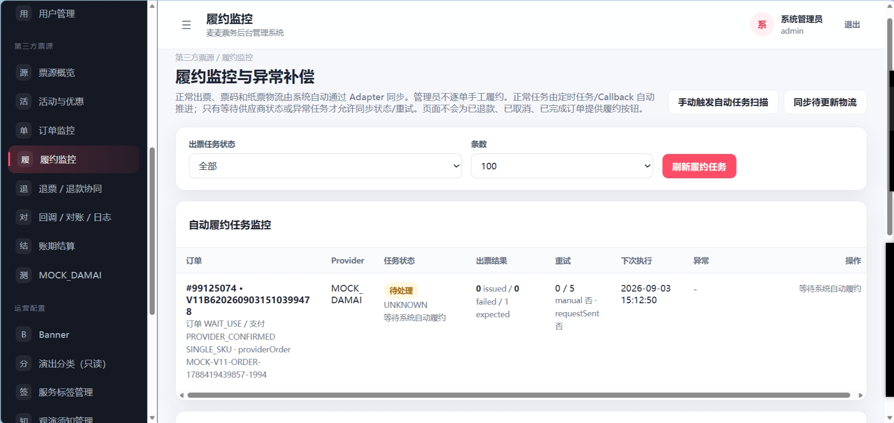
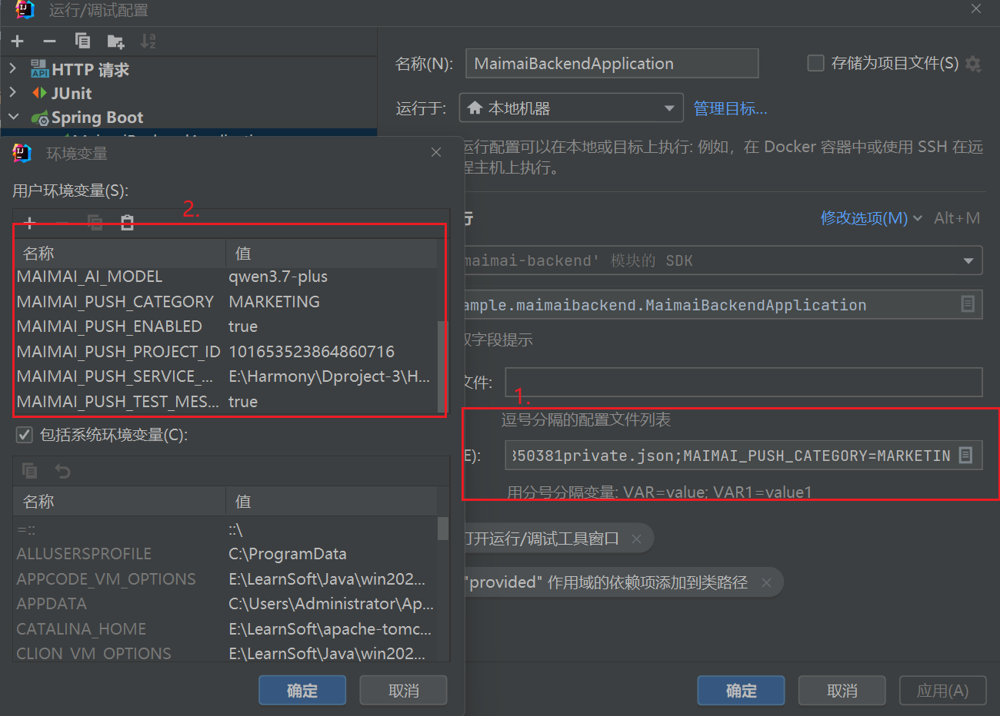
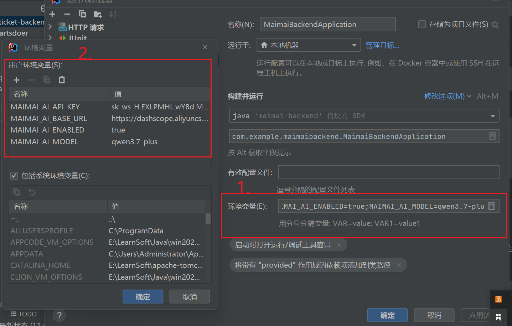

# 麦麦（Maimai）票务聚合分销平台后端

`maimai-backend` 是麦麦 HarmonyOS 票务客户端的业务后端，同时提供基于 Thymeleaf 的平台运营后台。

系统定位为 **票务聚合分销平台 + 平台运营后台**。HarmonyOS 客户端只调用麦麦统一 API，演出资源、价格、库存、订单、出票、退款和通知等第三方差异统一收敛在后端 Provider Adapter / Gateway 中；平台自己的展示、运营和用户业务由麦麦业务域维护。

当前项目主要使用内置 `LOCAL_MOCK` Provider 模拟第三方票源，用于完整验证资源同步、下单、出票、退款、异常恢复等票务链路，不将 Mock 能力描述为真实生产票源接入。

---

## 系统架构

```text
HarmonyOS App
      │
      ├─ HTTP / JSON
      │
      └─ SSE / AI
      ▼
┌─────────────────────────────────┐
│         maimai-backend          │
│                                 │
│  用户业务 / 演出展示 / 订单      │
│  票夹 / 退款 / 通知             │
│                                 │
│  AI Gateway                     │
│      ↓                          │
│  OpenAI-compatible LLM          │
│      ↓ Tool                     │
│  麦麦业务 Service / MySQL       │
│                                 │
│  Provider Adapter / Gateway     │
└───────────────┬─────────────────┘
                │
                ▼
        第三方票源 / LOCAL_MOCK

Browser
   │
   ▼
Thymeleaf 平台运营后台
```

核心原则：

> 用户只与麦麦业务系统交互，Provider 负责收敛第三方票源差异；平台运营字段与 Provider 同步字段分开管理，避免第三方同步覆盖平台自行维护的业务数据。

---

## 技术栈

| 技术          | 当前实现                                   |
| ----------- | -------------------------------------- |
| Java        | 17                                     |
| Spring Boot | 4.1.0                                  |
| Web         | Spring Web MVC                         |
| ORM / SQL   | MyBatis + JDBC                         |
| 数据库         | MySQL 5.7                              |
| 连接池         | Druid 1.2.28                           |
| 运营后台        | Thymeleaf                              |
| 参数校验        | Jakarta Validation / Spring Validation |
| 二维码         | ZXing 3.5.3                            |
| AI          | OpenAI-compatible HTTP API             |
| 构建          | Maven / Maven Wrapper                  |

默认服务端口：

```text
8080
```

默认数据库：

```text
maimai_ticket
```

---

# 主要业务能力

## 1. 演出与平台展示

提供 HarmonyOS 客户端所需的：

* 首页 Banner；
* 分类；
* 搜索；
* 演出项目；
* 场馆；
* 场次；
* 票档；
* 服务标签；
* 观演须知；
* 退款规则；
* 媒体资源；
* 想看状态。

平台运营字段与第三方同步字段分离，避免 Provider 同步覆盖平台自行维护的展示和运营内容。


---

## 2. Provider Adapter / Gateway

第三方票源统一通过 Adapter / Gateway 接入。

主要职责包括：

* Provider 注册与路由；
* 资源同步；
* Project / Session / SKU Mapping；
* 价格与库存查询；
* Provider 订单创建；
* 支付确认；
* 订单查询；
* 结果不确定恢复；
* 出票；
* 退款；
* Provider Callback；
* Gateway Log；
* 对账与结算相关数据。

当前主要联调 Provider：

```text
LOCAL_MOCK
```

用于模拟第三方演出资源、实时库存、订单、出票、退款以及请求超时、结果不确定等异常场景。

---

## 3. 单票档订单模型

当前订单模型固定为：

```text
一个订单
= 一个项目
+ 一个场次
+ 一个票档
+ N 张同票档票
```

每张实名票绑定一个不同观演人。

当前不支持：

* 一个订单混合多个票档；
* 一个订单跨多个场次；
* 同一实名观演人在同一订单重复占用多张实名票。

---

## 4. 下单幂等与结果不确定恢复

客户端提交订单时使用客户端提交号 / Provider 幂等键防止重复创建。

如果 Provider 已有可能成功创建订单，但麦麦侧发生请求超时或响应丢失，不直接重新创建 Provider 订单，而是进入结果恢复流程：

```text
UNKNOWN_RESULT
      ↓
按商户订单号 / Provider 幂等键查询原订单
      ↓
找到原单
      ↓
恢复麦麦本地订单状态

仍无法确认
      ↓
重试 / 人工确认
```

目标是避免网络异常导致第三方重复下单。

---

## 5. 出票与票夹

电子票链路支持：

* 出票中；
* 出票成功；
* 出票异常 / 失败；
* 静态电子凭证；
* 动态二维码；
* 已使用；
* 已失效；
* 检票；
* 票务操作日志。

项目中同时存在纸质票、配送和现场取票相关领域模型及 Provider 数据能力。

当前完整产品演示仍以电子票履约链路为主，不将纸质票描述为已经完整生产化的履约能力。

---

## 6. 退款

当前用户退款按整单处理。

系统区分：

```text
用户侧退款业务状态
≠
Provider 退款协同状态
```

支持：

* 退款规则查询；
* 用户退款申请；
* Provider 退款协同；
* 退款进度同步；
* 成功 / 失败状态；
* 后台退款管理。

---

## 7. Push 通知

后端提供：

```text
设备注册
   ↓
业务事件扫描
   ↓
通知任务生成
   ↓
Push 投递
   ↓
失败重试
```

当前覆盖的主要通知事件包括：

* 出票成功；
* 出票异常 / 失败；
* 退款进度；
* 退款成功；
* 退款失败；
* 演出改期；
* 演出取消；
* 场馆变更；
* 想看演出开售。

Push 默认关闭，未配置真实 Push 服务凭据时不会影响普通业务启动。

---

## 8. AI Gateway

后端提供 SSE AI 接口，使用 OpenAI-compatible 模型作为自然语言交互层，并通过受控 Tool 查询麦麦票务业务数据。

当前核心票务 Tool：

```text
searchPerformances
getPerformanceDetail
getSessions
getTicketSkus
getRefundRule
```

AI 层支持：

* 城市语义；
* 时间范围；
* 价格范围；
* 演出分类；
* 场馆；
* 排序；
* 多轮 Search Context；
* 搜索结果序号引用；
* 实体连续追问；
* 当前结果集合批量查询；
* 最低价 / 最高价比较；
* 时间比较；
* 场馆别名解析；
* SSE 流式文本；
* 结构化演出卡片结果。

演出名称、场馆、场次、票价、库存、退款规则等票务事实必须来自 Tool / MySQL 数据，不由模型直接生成。

AI 当前只开放查询类 Tool，不直接执行付款、退款提交等不可逆操作。

---

# 平台运营后台

后台入口：

```text
http://localhost:8080/admin/login
```

后台主要覆盖：

* Dashboard；
* 演出项目；
* 场馆；
* 场次；
* 票档；
* Banner；
* 分类；
* 服务标签；
* 观演须知 / 公告；
* 退款规则；
* 用户；
* 订单；
* 退款；
* 票务凭证；
* 出票任务与异常；
* 检票与日志；
* Provider 资源同步；
* Provider 订单；
* 履约；
* Provider 退款协同；
* 活动 / 优惠资源；
* 对账 / 结算；
* Gateway Log。

管理员账号存储于：

```text
admin_account
```

公开仓库不提供生产管理员账号或固定生产密码。


## 后台界面预览

平台运营后台基于 Thymeleaf 实现，用于管理麦麦业务数据，并查看 Provider 资源同步、订单履约与异常处理状态。


### 演出运营管理



### 订单管理



### 出票与履约




---

# 数据域设计

票务数据按照职责划分为不同数据域。

```text
mock_*
```

用于 LOCAL_MOCK Provider，模拟第三方票源接口返回和第三方侧订单、出票、退款等数据。

```text
ticket_source_*
```

用于 Provider 注册、资源 Mapping、订单桥接、出票、退款、物流、回调、Gateway Log、对账和结算等统一票源域数据。

```text
performance_*
```

用于麦麦客户端展示和平台运营侧的演出项目、场次等业务数据。

第三方资源到麦麦业务数据的映射关系大致为：

```text
Provider Project
      ↓
performance_project

Provider Session
      ↓
performance_session

Provider SKU
      ↓
ticket_sku
```

双方资源 ID、同步状态和桥接关系由 `ticket_source_*` Mapping 表维护。

---

## 库存与价格边界

库存统一采用以下语义：

```text
> 0     Provider 明确返回有库存
0       Provider 明确返回售罄
NULL    Provider 未提供明确库存 / 库存未知
```

因此：

```text
NULL ≠ 0
```

本地库存和价格可以作为客户端展示快照，但真正创建订单时仍需要按照对应 Provider 的实时校验结果执行。

价格层面区分：

```text
Provider 票面价
Provider 销售价
Provider 结算价
麦麦平台售价
```

客户端 API 不暴露 Provider 结算价、内部凭据、内部错误堆栈等平台内部信息。

---

# 主要目录

```text
src/main/java/com/example/maimaibackend/
├─ ai/                   # AI Gateway、语义、Context、Tool、LLM Provider
├─ common/               # Result、统一异常处理等
├─ config/               # Web / Session / Media 等配置
├─ controller/           # HarmonyOS 客户端 API
├─ controller/admin/     # 平台运营后台 API
├─ dto/                  # Request DTO
├─ mapper/               # MyBatis Mapper
├─ media/                # 媒体资源管理
├─ notification/         # Push 注册、事件扫描、投递、重试
├─ service/              # 麦麦业务 Service
├─ ticketsource/         # Provider Gateway / Mapping / 订单 / 出票 / 退款
├─ util/                 # 通用工具
└─ vo/                   # 客户端 / 后台 View Object

src/main/resources/
├─ mapper/               # MyBatis XML
├─ static/admin/         # 后台静态资源
├─ templates/admin/      # Thymeleaf 后台页面
└─ application.yml

database/
└─ maimai_ticket.sql     # MySQL 初始化脚本
```

---

# 数据库初始化

仓库提供：

```text
database/maimai_ticket.sql
```

脚本包含：

* `maimai_ticket` 数据库创建；
* 当前业务表结构；
* 索引与唯一约束；
* LOCAL_MOCK 演示数据；
* 演出、场馆、场次、票档等基础展示数据。

公开仓库中的初始化数据仅用于项目演示，不应包含真实用户数据、真实证件信息、Push Token、真实第三方凭据或生产密钥。

> 注意：脚本包含 `DROP TABLE IF EXISTS`，请勿直接导入已有生产数据库。

---

## MySQL 命令行创建数据库

确认本机已经安装 MySQL 5.7，并且 `mysql` 命令已经加入 PATH。

### Windows CMD

在项目根目录执行：

```cmd
mysql -uroot -p < database\maimai_ticket.sql
```

随后输入本机 MySQL 密码。

### Windows PowerShell

PowerShell 可以通过 CMD 执行输入重定向：

```powershell
cmd /c "mysql -uroot -p < database\maimai_ticket.sql"
```

随后输入本机 MySQL 密码。

---

# 管理员初始化

公开仓库不建议直接保存开发环境管理员密码。

项目已经提供：

```text
src/main/java/com/example/maimaibackend/util/AdminPasswordGenerator.java
```

该工具用于生成后台管理员所需的 PBKDF2 密码哈希。

在 IDEA 中运行：

```text
AdminPasswordGenerator
```

并将希望使用的后台密码作为 Program arguments 传入。

程序会输出：

```text
pbkdf2$...
```

将生成的哈希写入管理员表：

```sql
INSERT INTO admin_account (
    username,
    password_hash,
    nickname,
    account_status,
    create_time,
    update_time
) VALUES (
    'admin',
    '这里替换为 AdminPasswordGenerator 生成的 PBKDF2 哈希',
    '系统管理员',
    'ENABLED',
    NOW(),
    NOW()
);
```

随后即可使用：

```text
http://localhost:8080/admin/login
```

登录平台运营后台。

---

# 本地运行

## 环境要求

建议环境：

```text
JDK 17
MySQL 5.7
```

项目已经包含 Maven Wrapper，因此不要求本机单独安装 Maven。

---

## 1. 克隆项目

```bash
git clone <repository-url>
cd maimai-ticket-backend
```

---

## 2. 初始化数据库

执行：

```text
database/maimai_ticket.sql
```

默认数据库名：

```text
maimai_ticket
```

---

## 3. 配置数据库连接

默认配置位于：

```text
src/main/resources/application.yml
```

默认连接：

```text
jdbc:mysql://localhost:3306/maimai_ticket
```

数据库连接信息建议通过 IDEA 的 Spring Boot 运行配置注入。

进入：

`Run / Debug Configurations → Spring Boot → maimai-backend → Environment variables`

按需配置：

| Name | Value |
| --- | --- |
| `DB_USERNAME` | `root` |
| `DB_PASSWORD` | `你的 MySQL 密码` |
| `MAIMAI_DB_URL` | `jdbc:mysql://localhost:3306/maimai_ticket?useUnicode=true&characterEncoding=utf8&serverTimezone=GMT%2B8` |

如果本机配置与默认值一致，只需按实际环境配置必要变量。

---

## 4. 启动后端

如果需要启用 AI、Push 或自定义媒体目录，请先在 IDEA 的 `Edit Configurations` 中配置相应环境变量，再启动 Spring Boot 后端。


---

# HarmonyOS 客户端联调

配套客户端：

```text
HarmonyOS-Ticket-App
```

客户端接口配置位于：

```text
entry/src/main/ets/network/ApiConfig.ets
```

本机模拟环境默认后端地址：

```text
http://localhost:8080
```

真机 / 云真机调试时，需要将客户端 API 地址配置为设备能够访问到的后端地址。

公网调试地址属于本地开发环境配置，不写死在公开仓库中。

---

# 可选环境变量 - 编辑配置

普通票务业务不要求启用 AI 和 Push。外部服务配置建议通过 IDEA 的 Spring Boot 运行配置注入，不将 API Key、Push 凭据、本机目录或临时公网地址写入源码。

---

## 媒体目录


编辑配置：

| Name                | Value                  |
| ------------------- | ---------------------- |
| `MAIMAI_MEDIA_ROOT` | `E:\你的目录\maimai-media` |


未设置时使用项目配置中的本地默认目录。

---

## Push

默认：

```text
MAIMAI_PUSH_ENABLED=false
```

需要联调真实 Push 时自行配置IDEA Edit Configurations 的环境变量：

| Name                               | Value                    |
| ---------------------------------- | ------------------------ |
| `MAIMAI_PUSH_ENABLED`              | `true`                   |
| `MAIMAI_PUSH_TEST_MESSAGE`         | `true`                   |
| `MAIMAI_PUSH_PROJECT_ID`           | `你的 AGC Push Project ID` |
| `MAIMAI_PUSH_SERVICE_ACCOUNT_FILE` | `服务账号 JSON 的绝对路径`        |
| `MAIMAI_PUSH_CATEGORY`             | `你实际申请/使用的消息分类`          |


---

## AI

默认：

```text
MAIMAI_AI_ENABLED=false
```

需要启用 AI Gateway 时设置 环境变量：

| Name                 | Value                       |
| -------------------- | --------------------------- |
| `MAIMAI_AI_ENABLED`  | `true`                      |
| `MAIMAI_AI_BASE_URL` | `https://api.openai.com/v1` |
| `MAIMAI_AI_API_KEY`  | `你的 API Key`                |
| `MAIMAI_AI_MODEL`    | `你实际使用的模型名`                 |


---

# 当前实现边界

该项目主要用于票务平台业务架构、HarmonyOS 客户端联调以及 Provider 接入流程展示。

当前以下能力仍属于测试 / 模拟环境：

* 主要 Provider 为 `LOCAL_MOCK`；
* 不代表已经完成大麦、猫眼、票牛等真实渠道的商务授权和生产接口联调；
* HarmonyOS 客户端支付为 Mock 支付；
* 短信能力不是生产短信服务；
* 当前不支持自主选座；
* AI 模型、Push Kit 等外部服务需要使用者自行配置合法凭据；
* 纸质票、快递和现场取票相关领域模型已经存在，但当前不将其描述为完整生产化交付能力。

---

# 配套 HarmonyOS 客户端

配套项目：

```text
HarmonyOS-Ticket-App
```

客户端主要负责：

* ArkUI 页面与交互；
* Navigation 核心票务业务栈；
* 手机 / 平板响应式布局；
* 长列表与缓存优化；
* 服务卡片；
* Push；
* Agent Reminder；
* SSE AI；
* 演出浏览；
* 搜索；
* 订单；
* 票夹；
* 退款。

后端负责统一收敛客户端业务、Provider 差异、票务状态、履约、通知以及 AI Tool 数据访问。
